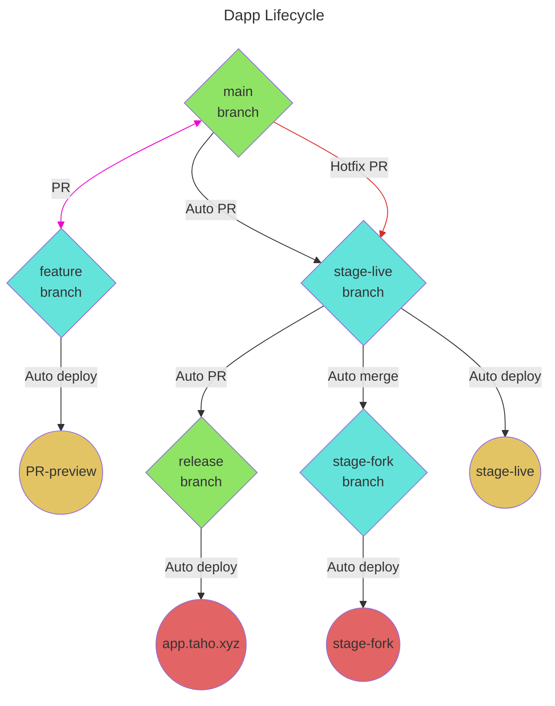

# Development to Production Flow

### Branches

- `main`
  - branch `main` is the base branch for current development
  - every feature branch should be merged into `main` via pull request
- `stage-live`
  - base for running the staging environment that is running on the live chain
  - stage-live website is building based on the current status of the branch `stage-live`
  - changes from `main` should be merged into the `stage-live` in batches using PR
  - person QAing stage environment should be the one to accept and merge the PR - merging the PR means the staging environment will rebuild and manual tests can be started
- `stage-fork`
  - state of the branch `stage-fork` should be always the same as `stage-live`
  - base for building the staging environment that is running on the chain fork
  - stage-fork website is building based on the current status of the branch `stage-fork`
  - changes on `stage-live` should be auto-merged to the `stage-fork` by the Github Action
  - accepting the PR to `stage-live` means stage-fork website will rebuild as well as stage-live website
- `release`
  - changes from `stage-live` branch should be opening the PR to `release` branch
  - batch of changes from the PR should be tested manually on staging environments and then PR to release should be accepted and merged by QA
  - production environment is building based on the current status of the branch `release`

### Environments

- [app](https://app.taho.xyz/) or [release](https://release--taho-development.netlify.app/) - production env based on branch `release`
- [stage fork](https://stage-fork--taho-development.netlify.app/) - staging env based on branch `stage-fork`
  - running on Tenderly fork of Arbitrum
  - can reset the fork by clicking a few times in the logo
  - to be used together with special build of the Taho wallet 
- [stage live](https://stage-live--taho-development.netlify.app/) - staging env based on branch `stage-live`
  - running on live chain
  - to be used with production version of the Taho wallet
- [main](https://main--taho-development.netlify.app/) - development build based on `main`
  - no need to do QA here
  - running on chain fork
  - can be used to preview most recent development

### Hotfix flow

If production needs a quick fix then:

- create a feature branch from `main`
- fix it as usual, merge back to `main`
- cherry-pick the fix to separate branch
- create a separate PR to `stage-live` 
- merge it so fix will be added to the current batch of chages from staging env
- QA on staging
- merge PR `stage-live -> release`

